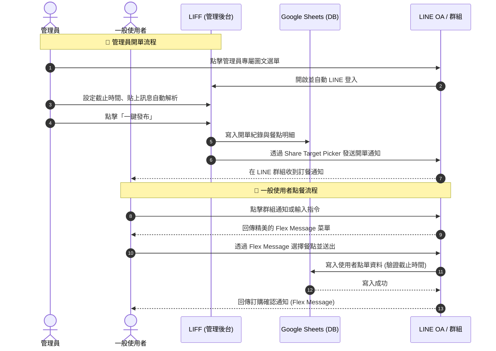

# 🍱 Bento 訂餐管理系統 (LINE LIFF)

這是一個專為公司/團隊訂餐所設計的管理後台，透過 **LINE LIFF** 與 **React (Vite)** 開發。
此系統協助訂餐管理員能夠快速建立午餐或晚餐的訂餐表單，並具備強大的「**老闆訊息自動解析**」功能，大幅節省手動輸入菜單的時間。建立完成後，系統會自動寫入雲端紀錄（如 Google Sheets）並一鍵將訂單發送至 LINE 群組，通知大家開始點餐！

---

## ✨ 核心特色功能

- 🤖 **智慧菜單解析 (Smart Parsing)**
  - 管理員只需將便當店老闆傳來的「原始訊息」（如：*今天魚便當秋刀魚110，水餃有高麗菜(生的110、熟的60)*）貼上。
  - 系統會透過正規表達式自動解析出：品項名稱、價格、類別（如水餃、合菜、炸魚），甚至能自動抓取「**限量**」份數。
- 📋 **常規菜單串接 (Google Sheets API)**
  - 系統可透過 API 動態讀取固定的常規菜單（如固定的飲料、湯品或預設便當），並可輕鬆透過關鍵字搜尋篩選。
- 🚀 **LINE 快速分享 (Share Target Picker)**
  - 結合 LINE LIFF 授權，自動抓取管理員名稱。
  - 一鍵產生精美的訂餐公告，並利用 LIFF 的 `shareTargetPicker` 讓管理員直接勾選多個 LINE 群組發布。
- ⏳ **智慧截止時間 (Smart Deadline)**
  - 內建時間選擇器，並自動為後端配置 1 分鐘的緩衝期，避免網路延遲導致群組成員壓線訂餐失敗。
- 📊 **快速統計與對帳 (Quick Statistics)**
  - 管理者可直接透過 LINE OA 快速統計當日餐點數量與總費用，輕鬆完成對帳作業。
  - *(近期開發計畫：未來將支援「多日費用統計明細」功能，提供更完整的週期性結算報表)*

---

## 🛠️ 技術堆疊 (Tech Stack)

### 前端
- **框架:** React 19 + Vite
- **UI 樣式:** Bootstrap 5 (Vanilla CSS) + 客製化 Glassmorphism 介面與微動畫
- **LINE 整合:** [@line/liff](https://developers.line.biz/en/docs/liff/overview/)

### 後端 / 部署
- **API 服務 (Firebase Functions):** 作為與 LINE Platform 及前端互動的後端邏輯。
- **資料庫 (DB):** 系統將資料全部存放於 Google Sheets，方便非技術人員查看與管理。
- **環境託管:** Firebase Hosting 與 Firebase Cloud Functions。

---

## ⚙️ 環境變數 (Environment Variables)

請在前端的 `public/` (或專案根目錄，取決於您的 Vite 設定) 下建立 `.env` 檔案，並填寫以下設定：

```env
# 您的 LINE LIFF ID (供管理員後台使用)
VITE_LIFF_ID=你的_LIFF_ID

# 您的後端 API 基礎路徑 (Firebase Functions URL)
VITE_API_BASE=你的_API_網址
```

---

## 🚀 安裝與執行 (Getting Started)

### 前端環境 (React + Vite)

1. **安裝依賴套件**
   請進入 `public` 目錄 (前端程式碼存放處) 並執行安裝：
   ```bash
   cd public
   npm install
   ```

2. **本地開發伺服器**
   ```bash
   npm run dev
   ```
   *注意：LINE LIFF 的某些功能（如 `shareTargetPicker` 或 `getProfile`）在本地瀏覽器可能會受限，建議使用 ngrok 或部署到 HTTPS 環境以獲得完整測試體驗。*

3. **生產環境打包**
   ```bash
   npm run build
   ```

### 後端環境 (Firebase Functions - Python)

專案根目錄附帶了一個 `requirements.txt`，這是為了方便設定與了解 Firebase 雲端函式所需的 Python 開發環境。

1. **安裝 Python 依賴**
   如果您需要在本地開發或測試後端腳本，請安裝對應的依賴：
   ```bash
   pip install -r requirements.txt
   ```
   *(註：實際 Firebase 部署時，會自動讀取 `functions/requirements.txt` 來打包環境)*

---

## 📂 專案結構簡介

```text
bento/
├── .firebase/           # Firebase 相關設定快取
├── functions/           # Firebase Cloud Functions (後端邏輯)
├── public/              # 前端 React (Vite) 專案主目錄
│   ├── src/             # 前端原始碼
│   │   └── App.jsx      # 核心 UI 與業務邏輯 (解析、API 請求、LIFF 互動)
│   ├── .env             # 前端環境變數
│   ├── index.html       # Vite 進入點
│   ├── package.json     # 前端依賴與 Scripts
│   └── vite.config.js   # Vite 設定檔
└── firebase.json        # Firebase 部署設定
```

---

## 💡 系統角色與使用流程 (Roles & Workflow)

系統將使用者分為「一般使用者」與「管理員」兩種角色，並透過 LINE OA 與 LIFF 區分操作介面。

### 🔄 完整互動流程圖



### 👤 一般使用者 (LINE OA 端)
- **操作介面:** 只能透過 LINE 官方帳號 (LINE OA) 進行互動。
- **Flex 訊息互動:** LINE OA 機器人主要利用發送與回覆精美的 **Flex Message**，讓使用者能夠直覺地查看菜單、點餐以及確認訂單內容。
- **圖文選單 (Rich Menu):** 系統會根據使用者的身分與狀態，動態切換不同的圖文選單（例如：「點餐選單」、「查看訂單選單」等）。
- **限制與流程:**
  1. 使用者在群組或私訊中收到開單通知後，可透過圖文選單或指令呼叫點餐介面。
  2. 受到截止時間的限制，一旦超過管理員設定的截止時間，使用者將無法再透過 LINE OA 成功點單。

### 👑 管理員 (LIFF 前端)
- **操作介面:** 透過專屬的 LINE LIFF 網頁進行後台管理。
- **圖文選單 (Rich Menu):** 管理員的 LINE 帳號會綁定專屬的「管理員版」圖文選單，以便快速叫出管理後台 (LIFF) 入口。
- **開單流程:**
  1. **登入與授權**: 管理員透過圖文選單開啟 LIFF 網頁，自動進行 LINE 登入。
  2. **建立菜單**: 設定餐別、截止時間，貼上老闆文字訊息自動解析特餐，並勾選常規菜單。
  3. **一鍵發布**: 點擊發布後，資料儲存至 Google Sheets，並彈出 LINE 聯絡人選擇器，讓管理員直接將開單訊息傳送至公司群組。

---

*Powered by React, Vite, and LINE LIFF.*
